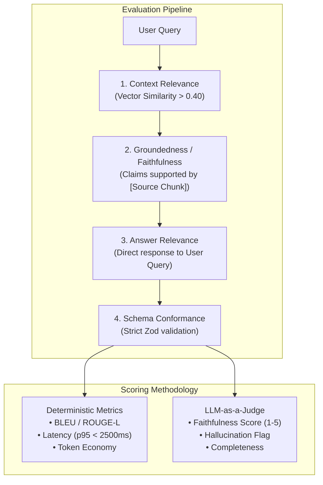
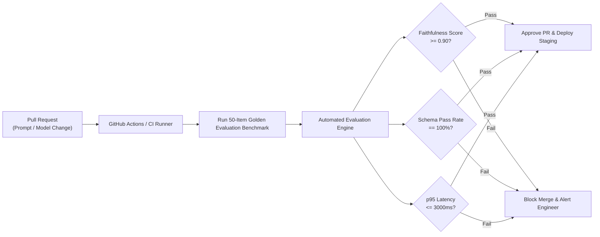
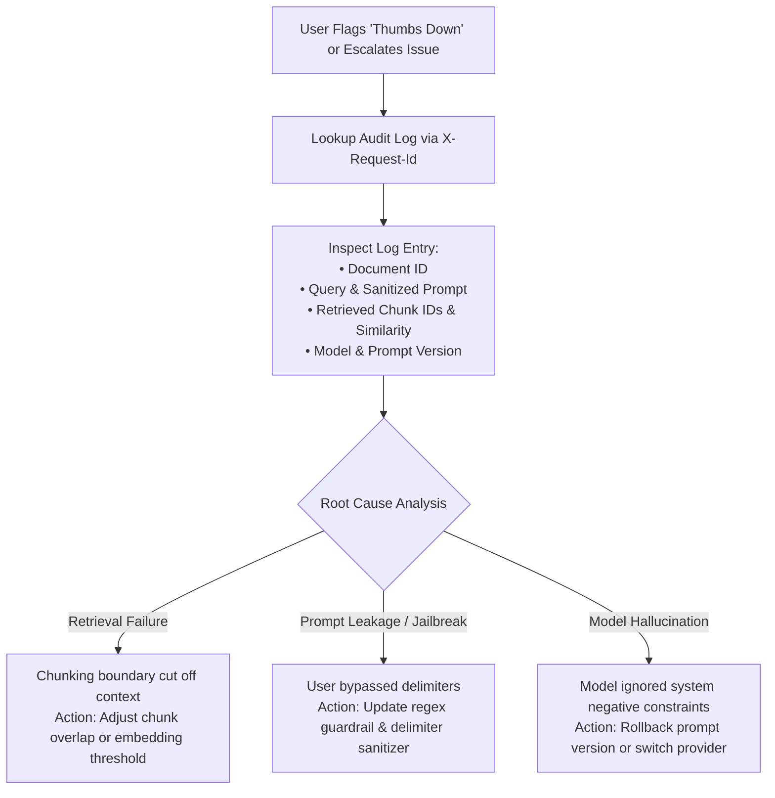

# AI Evaluation, Reliability & Incident Playbook

This document details the evaluation methodology, regression detection framework, and operational playbook for ensuring model reliability and mitigating incorrect outputs in production.

---

## 1. Measuring AI Output Quality

Traditional unit tests (`expect(output).toBe('constant')`) fail when evaluating non-deterministic LLMs. We adopt a **multi-tiered evaluation architecture** structured around the **RAG Triad** and schema compliance:

### 1.1 The RAG Triad Metrics
1. **Context Relevance**: Did the vector store retrieve chunks that actually contain the necessary information?
   - *Measurement*: Cosine similarity score between query embedding and retrieved chunk vectors (Target: $\ge 0.45$).
2. **Groundedness (Faithfulness)**: Does the generated answer contain only facts supported by the retrieved document chunks?
   - *Measurement*: Automated sentence-level claim extraction. Each claim is cross-referenced against the context. If an unsupported claim is made, it is flagged as a hallucination.
3. **Answer Relevance**: Did the model actually answer the user's question, or did it deflect?
   - *Measurement*: Embedding similarity between the question and the generated answer, combined with intent-fulfillment classifiers.

### 1.2 Structured Output Verification
For extraction tasks, quality is measured quantitatively against a curated "Golden Set" of documents:
- **Precision / Recall / F1-Score**: Evaluated on extracted entities (Organizations, Dates, Financial metrics) against human-annotated ground truth.
- **Syntactic Validity**: Percentage of LLM completions that pass `StructuredInsightsSchema.safeParse()` without requiring error fallbacks (Target: $\ge 99.8\%$).

---

## 2. Regression Detection After Prompt & Model Changes

When changing prompt versions (`v1` $\rightarrow$ `v2`) or switching models (e.g. `gemini-1.5-flash` $\rightarrow$ `gpt-4o-mini`), we prevent regressions through **Automated CI/CD Prompt Evaluations**:

### 2.1 The Golden Dataset Strategy
We maintain a version-controlled benchmark dataset of 50 enterprise documents across 5 domains (Legal, Financial, Technical, Medical, Administrative) with 200 associated adversarial test questions:
- **Direct Queries**: Factual queries with known single-source answers.
- **Multi-Hop Queries**: Questions requiring synthesis across multiple distinct chunks.
- **Unanswerable / Out-of-Scope Queries**: Queries deliberately asking for information absent from the text (validating that the model correctly refuses to answer rather than hallucinating).
- **Adversarial / Injection Queries**: Testing prompt jailbreak resistance.

### 2.2 Shadow / Canary Evaluation in Production
Before rolling out prompt `v2` to 100% of users:
1. **Shadow Mode**: 5% of production traffic runs both `v1` and `v2` asynchronously in the background. Latency, token consumption, and model confidence are logged to CloudWatch.
2. **Canary Deployment**: 10% of users receive `v2`. Client-side thumbs-up/down ratios and user session lengths are monitored in real time.

---

## 3. Operational Playbook: "Handling AI Wrong Answers in Production"

When an AI delivers an incorrect, hallucinated, or unsafe answer in production, our architecture provides an immediate multi-tiered response protocol:

### Step 1: Real-Time Detection & User Mitigation
- **Confidence Threshold Warning**: If the calibrated groundedness score falls below 50%, the frontend automatically renders an alert badge: *"Low Confidence: This answer has weak semantic grounding in the source document. Verify independently."*
- **Human-in-the-Loop Feedback**: Users can click **Thumbs Down** with an optional flag (*Hallucination*, *Incomplete*, *Off-topic*).
- **Refine & Re-Ask**: Users can click the "Refine" button to modify their prompt or immediately re-generate with a fallback prompt version.

### Step 2: Immediate Incident Triage (Engineering)

### Step 3: Hardened Guardrail Injection (Fast Fix)
If a critical model behavior bug is discovered in production (e.g. model reveals internal prompts or generates unsafe financial advice):
1. **Dynamic Provider Fallback**: Switch `LLM_PROVIDER` in AWS Secrets Manager from external provider to a hardened fallback without redeploying code.
2. **Prompt Version Hot-Swap**: Update `DEFAULT_PROMPT_VERSION` from `v2` to `v1` via ECS environment variables in under 60 seconds.
3. **Blacklist Injection**: Add the offending pattern to `GuardrailService.INJECTION_PATTERNS`.
