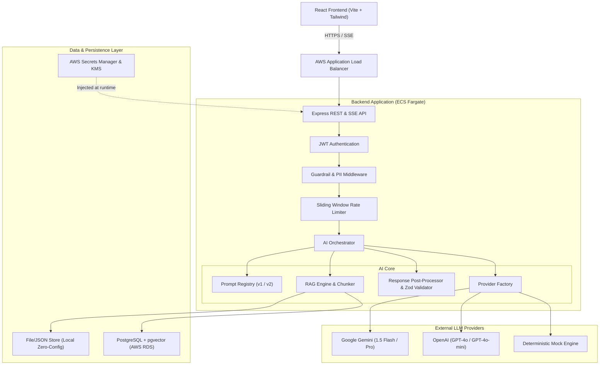
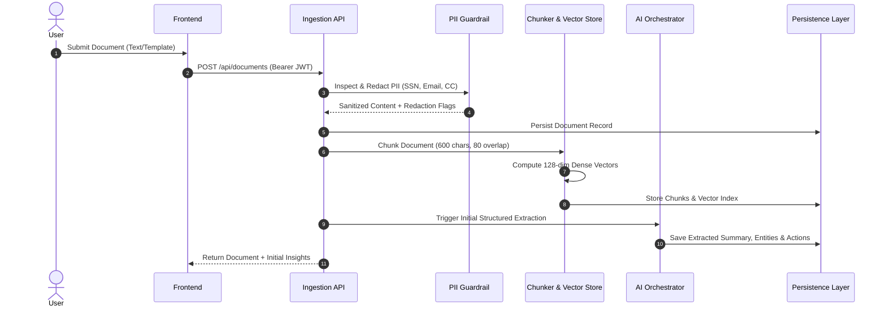
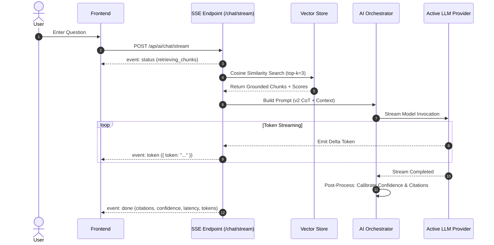

# System Architecture & Technical Design

## 1. System Overview

**DocIntel AI** is a production-grade, AI-assisted document intelligence platform designed to ingest complex enterprise documents, generate structured insights (summaries, classifications, entity graphs, action items), and enable natural language Q&A grounded in primary source text via Retrieval-Augmented Generation (RAG).

---

## 2. Core Architectural Pillars

### 2.1 Clean Separation of AI Concerns
A frequent antipattern in junior AI applications is tightly coupling prompt strings, API calls, and business logic inside controller functions. DocIntel enforces strict architectural decoupling:

1. **Prompt Construction Layer** (`services/ai/prompts/`):
   - Versioned prompt templates (`v1`, `v2`) with descriptive release metadata.
   - Strict delimiter encapsulation (`<<<START_USER_QUESTION>>>`) preventing prompt escape.
   - Declarative system instructions and parameter tuning (temperature, maxTokens, topP).
2. **Model Invocation Layer** (`services/ai/providers/`):
   - Uniform `LLMProvider` interface defining standard text generation and token streaming contracts.
   - Dynamic provider selection (`gemini`, `openai`, `mock`) with seamless failover and configuration discovery.
   - Dedicated `MockProvider` delivering token-by-token simulated SSE streaming and schema-compliant extraction without API keys.
3. **Response Post-Processing Layer** (`services/ai/postProcessing.service.ts`):
   - Markdown code-fence stripping and JSON syntax recovery.
   - Strict schema validation using **Zod** (`StructuredInsightsSchema`).
   - Grounded citation extraction scanning for `[Source Chunk X]` tags.
   - Confidence score calibration multiplying retrieval relevance with model self-assessment.

---

## 3. End-to-End Data Flow

### 3.1 Document Ingestion & RAG Indexing

### 3.2 Interactive RAG Q&A with Server-Sent Events (SSE)

---

## 4. Architectural Trade-offs & Decisions

| Decision | Chosen Approach | Alternative Considered | Rationale |
| :--- | :--- | :--- | :--- |
| **Backend Runtime** | Node.js + TypeScript (Express) | Java (Spring Boot) | Node.js provides lightweight SSE streaming primitives, zero-overhead asynchronous I/O for LLM streaming, and identical TypeScript types shared across frontend/backend. |
| **Local Persistence** | Dual Adapter: File-Backed Atomic Store + PostgreSQL (`schema.sql`) | In-Memory Only or SQLite C-Bindings | Avoids native compilation headaches (`node-gyp`) on Windows/macOS while providing instantaneous zero-config startup for reviewers and complete PostgreSQL DDL for production. |
| **Vector Engine** | Dense Normalized Hash Vectors + Cosine Dot Product | Pinecone / Weaviate Cloud | Eliminates external cloud dependencies for local reviewers; supports deterministic offline unit testing; seamlessly swaps to `pgvector` in AWS. |
| **Streaming Protocol** | Server-Sent Events (SSE) | WebSockets | SSE is unidirectional, lightweight, works seamlessly over HTTP/2, requires no bidirectional connection state on ALB, and has built-in client reconnection. |
| **Structured Output** | Zod Schema Validation with JSON Substring Recovery | OpenAI Function Calling Only | Schema validation works identically across all LLM providers (Gemini, OpenAI, Mock) without provider lock-in. |
